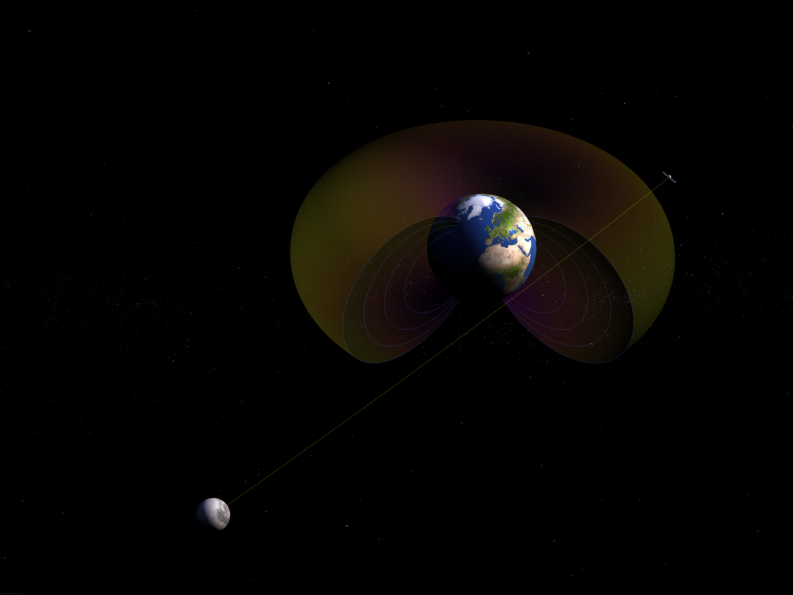

# Iono-LuGRE

[](https://viventriglia.github.io/iono-lugre/)

Official repository for the paper <i>Observing the Earth’s Plasmasphere and Ionosphere from the Lunar Surface</i> (Cesaroni et al. 2026, submitted to <i>Geophysical Research Letters</i>).
Read the preprint here: </b> [Pre-Print]https://doi.org/10.22541/essoar.176902858.83882772/v1</b>

## Overview

Surrounding our planet is a vast layer of charged particles called the <b>ionosphere/plasmasphere system</b>, which plays a critical role in <b>Space Weather</b>. Despite its importance, a significant <b>blind spot</b> exists between the top of our atmosphere and deep-space altitudes where Low Earth Orbit (LEO) satellites cannot observe the plasma layers above them.

This project leverages data from the <b>Lunar GNSS Receiver Experiment</b> (<b>[LuGRE](https://www.nasa.gov/centers-and-facilities/goddard/nasa-and-italian-space-agency-test-future-lunar-navigation-technology/)</b>), a pioneering mission that used the Moon as a platform to perform limb sounding of the Earth’s environment. By tracking GPS and Galileo signals from the lunar surface, LuGRE bridges observational gaps at altitudes exceeding 3,000 km.

<p align="center"> 
<em>Earth, Plasmasphere, a GNSS satellite, and the Moon (not drawn to scale).</em> </p>

## Key Findings

- <b>Refilling Efficiency</b>: LuGRE data indicates a lower plasma refilling efficiency than currently parameterized in standard models, e.g. Global Core Plasma Model (GCPM).

- <b>Lunar Observatory</b>: This project demonstrates that the Moon is an ideal location for permanent Space Weather observatories improving safety of space technology.

## Repository Structure

```bash
.
├── assets/               # Images, etc.
├── docs/                 # GitHub Pages source (interactive HTML plots)
├── src/                  # Functions for the processing and plotting of LuGRE data
├── GCPM_vs_LuGRE.ipynb   # Notebook to reproduce paper results
├── LICENSE               # GNU GPL license
├── requirements.txt      # Dependencies
└── README.md
```

## Data Access

The pre-processed GNSS dataset is available on [Zenodo](https://zenodo.org/records/18220778).
